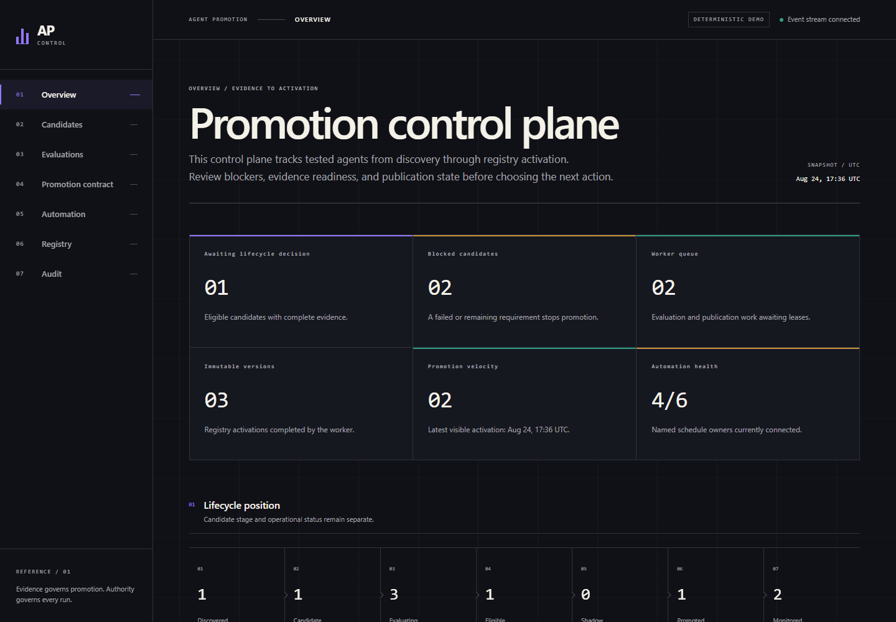
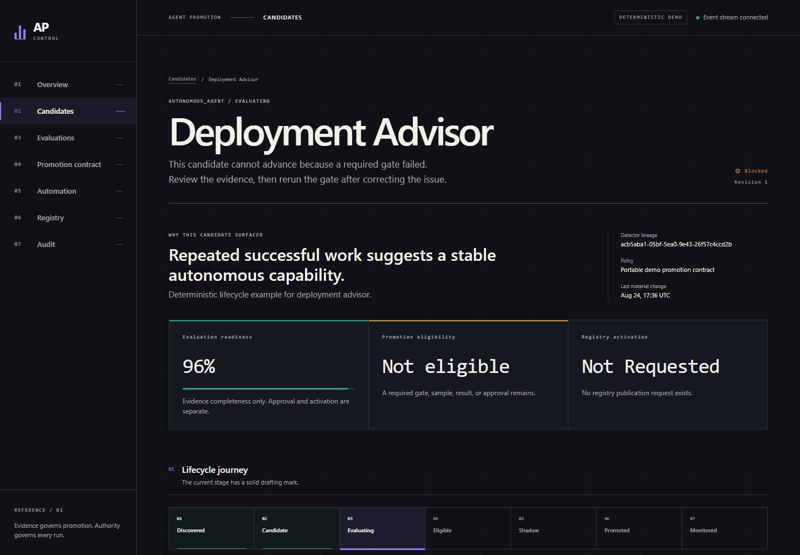

# Agent Promotion Control Plane

A private, portable reference implementation for deciding when tested agent versions may enter a production registry. The control plane separates evaluation readiness, lifecycle approval, and registry activation so a failed hard gate cannot be outscored and no agent is marked promoted before publication succeeds.

The demo needs Docker only. It uses deterministic detectors, evaluators, and a local registry; no cloud or model credentials are required.

## Start in under two minutes

Prerequisites: Docker Desktop with Docker Compose 2.20 or newer. Ports `3001` and `8000` must be available.

```bash
git clone git@github.com:paulmalmquist/agent-promotion-control-plane.git
cd agent-promotion-control-plane
docker compose up --build --wait --wait-timeout 180
```

- Control plane: <http://localhost:3001>
- API documentation: <http://localhost:8000/docs>
- Health: <http://localhost:8000/healthz>

Run the deterministic autonomous cycle from another terminal:

```bash
docker compose exec -T api python -m promotion_control_plane.cli.main run-demo-cycle --idempotency-key readme-demo-cycle
```

Windows operators may instead run `powershell -File scripts/demo-cycle.ps1`.

The cycle discovers a ninth candidate, plans and evaluates it, records its gate decision, queues registry publication, waits for worker activation, and records monitoring work. Repeating the command with the same idempotency key returns the original result.

Restore the fixed eight-candidate baseline through the idempotent demo API:

```bash
curl --fail-with-body -X POST \
  -H "Content-Type: application/json" \
  -H "Idempotency-Key: reset-demo-v1" \
  -d '{"actor":"demo-operator"}' \
  http://localhost:8000/api/v1/demo/reset
```

PowerShell equivalent:

```powershell
$headers = @{ 'Idempotency-Key' = 'reset-demo-v1' }
Invoke-RestMethod -Method Post -Uri 'http://localhost:8000/api/v1/demo/reset' -Headers $headers -ContentType 'application/json' -Body '{"actor":"demo-operator"}'
```

Reset is a demo-only maintenance operation. It atomically rebuilds the mutable fixture state,
preserves the append-only event table and sequence, and appends `DEMO_RESET_COMPLETED`.

Stop the stack without deleting its database:

```bash
docker compose down
```

To prove startup is idempotent, run the exact `docker compose up --build --wait --wait-timeout 180` command again. Use `docker compose down -v` only when you intentionally want to discard local demo data.

On Windows, `powershell -File scripts/verify-compose.ps1` validates Compose 2.20+, runs both startup passes, and checks all four services and seeded counts.

## What the demo shows





The seeded data covers discovery, incomplete samples, a high weighted score blocked by a hard-gate failure, registry publication pending and failed, promotion, monitoring, suspension after regression, and retirement. Six automation definitions include their external trigger owner and observed run history. The service never claims it will fire cron itself.

## Safety invariants

- Promotion is asynchronous. Approval queues publication; only worker success creates `PROMOTED` state and an immutable agent version.
- Hard gates are non-compensable. `FAILED` and `REMAINING` both block promotion.
- Empty requirement sets are satisfied (`1.0`), so readiness is defined without division by zero.
- Events are inserted with state changes in one transaction and protected from update or deletion by PostgreSQL.
- Mutations require `Idempotency-Key`; candidate mutations also require an expected revision.
- Work is claimed with PostgreSQL leases, heartbeats, bounded retries, and stable publication tokens.
- There is no force-promote route.

Promotion changes which tested version new production runs select. It does not authorize a run or grant tool access.

Runtime authority envelopes remain downstream controls for tools, inputs, budgets, validity, and run counts. See [Promotion Model](docs/PROMOTION_MODEL.md) and [ADR 0005](docs/adrs/0005-lifecycle-approvals-and-authority-envelopes.md).

## Repository map

```text
apps/web/                 Next.js standalone adapter and same-origin SSE route
packages/promotion-ui/    Browser-neutral React UI and governed copy rendering
services/api/             FastAPI application, domain, worker, CLI, and migrations
configs/                  Versioned policy, detector, evaluator, and copy artifacts
demo/                     Deterministic seed fixtures
docs/                     Architecture, operation, integration, and decision records
```

The workspace pins Node 24, Python 3.13, PostgreSQL 17, React 19, and a patched stable Next.js 16 release when available. Both npm and uv lockfiles are committed.

## Environment

The committed Compose defaults run without secrets. Copy `.env.example` only when you need to override them.

| Variable | Default purpose |
|---|---|
| `STARTUP_BOOTSTRAP` | Runs locked migration and seed bootstrap in local demo mode. |
| `DEMO_MODE` | Enables deterministic fixtures and demo actions. |
| `DATABASE_URL` | Selects PostgreSQL for host-side API, worker, and CLI commands. Compose supplies its own internal URL. |
| `API_INTERNAL_URL` | Lets a host-side Next.js server reach FastAPI. Compose supplies `http://api:8000`. |
| `OPENAI_EVAL_MODEL` | Selects the optional server-side rubric model. |
| `OPENAI_API_KEY` | Enables optional live rubric and copy certification; omit it for normal use. |

## Development and checks

Common local checks are documented in [Operations](docs/OPERATIONS.md). CI enforces backend lint, types, tests and coverage; Alembic drift; frontend lint, types, component tests, build and high-severity audit; line endings; OpenAPI and generated-type drift; Compose, Playwright and streaming tests; and pinned-SHA secret scanning.

`OPENAI_API_KEY` is optional. Without it, live rubric and semantic-copy certification report `unavailable` and deterministic tests still run. No result is falsely certified.

## Integrating elsewhere

Use the Python protocol ports or mount the browser-neutral React package with injected transport, navigation, subscriptions, lifecycle decisions, and semantic design tokens. Start with [Integration Guide](docs/INTEGRATION_GUIDE.md). The Paul OS transplant instructions are in [Paul OS Handoff](docs/PAUL_OS_HANDOFF.md).

## Security and licensing

Standalone demo mode is trusted and local. Production authentication, tenancy, authority envelopes, external scheduler ownership, and cloud artifact storage are intentionally replacement adapters. Review [Security](docs/SECURITY.md) before integrated use.

No license is included. Obtain a licensing decision before redistributing or accepting outside contributions.
