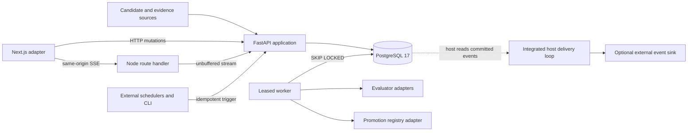
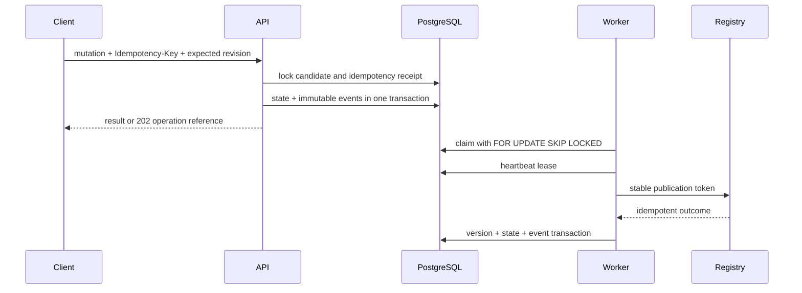

# Architecture

## System boundary

The control plane evaluates candidate versions and publishes eligible versions to a registry. It does not execute production runs, grant tool access, own cron, or replace a host system's authority model.



PostgreSQL is the source of truth for candidate state, work leases, immutable events, publication tokens, and registry outcomes. Server-Sent Events (SSE) are a replayable projection of stored event sequence numbers, not an in-memory message bus.

## Package boundaries

The Python service separates:

- `domain`: values, entities, invariants, and readiness math without framework, object-relational mapping, scheduler, filesystem, or model-provider imports.
- `application`: use cases and transaction orchestration.
- `api`: FastAPI routers, request models, RFC 7807 mapping, and streaming.
- `infrastructure`: SQLAlchemy repositories, PostgreSQL leases, migrations, and startup bootstrap.
- `adapters`: exported protocols plus deterministic and optional external providers.
- `worker`: claim, heartbeat, retry, and terminal-outcome loops for evaluations, schedule work, and registry operations.
- `cli`: explicit migration, seed, schedule trigger, demo, export, and worker-health commands.

The web workspace separates `apps/web`, which owns Next.js routing and server adapters, from `packages/promotion-ui`, which imports no `next/*` module and can mount inside another React host.

## Startup and deployment modes

Demo Compose runs only four long-lived services: `db`, `api`, `worker`, and `web`. The API entrypoint takes a PostgreSQL advisory lock, upgrades Alembic, performs idempotent seed-if-empty, releases the lock, and starts Uvicorn. The worker waits for API health. This avoids a one-shot init container being misreported as unhealthy by older Compose implementations.

Integrated and production modes disable startup bootstrap. Operators run migration and seed commands explicitly before starting replicas. See [Operations](OPERATIONS.md).

## Transaction and concurrency rules



Optimistic candidate revisions protect reviewers from acting on stale evidence. Idempotency receipts reject a reused key with a changed request body. Worker leases have an owner, expiry, heartbeat, attempt count, and bounded retry policy. A reclaimed operation reuses its stable publication token, allowing recovery after external success but before local commit.

## Event model

Every material state change emits one or more `promotion_events` in the same database transaction. Event-producing transactions take one transaction-scoped PostgreSQL advisory lock before allocating sequence values. That commit-order serialization prevents a replay cursor from observing a later sequence and then missing an earlier transaction that commits late. An event has an ordered sequence, schema version, actor, policy hash, correlation and causation identifiers, and relevant candidate, evaluation, job, or registry-operation links. A database trigger rejects `UPDATE` and `DELETE`; application repository permissions omit them as defense in depth.

Demo reset is a maintenance operation, not an event rewrite. It takes an exclusive maintenance lock, atomically rebuilds mutable fixture tables, preserves `promotion_events` and their sequence, and appends `DEMO_RESET_COMPLETED`. Worker claims take the matching shared lock during their claim transaction, so reset excludes new claims while rebuilding fixtures. It does not cancel a provider call that a worker already claimed and started.

The SSE endpoint emits stored sequence values as event IDs, uses `promotion_event` as the event name, sends `retry: 3000`, and writes keepalives every 15 seconds. Clients reconnect with `Last-Event-ID`; PostgreSQL fills disconnects or gaps.

## Same-origin stream adapter

The Next.js Node-runtime route is `force-dynamic`, fetches FastAPI with `cache: "no-store"` and the incoming abort signal, and returns the upstream `ReadableStream` without reading, cloning, parsing, or accumulating it. It forwards filters and `Last-Event-ID`; it removes content length, transfer encoding, content encoding, and hop-by-hop headers. It sets:

```text
Content-Type: text/event-stream; charset=utf-8
Cache-Control: no-cache, no-store, no-transform
X-Accel-Buffering: no
```

Normal Next.js compression remains enabled for non-streaming routes.

## Adapter ports

The service exports `CandidateSource`, `CandidateDetector`, `EvaluationSource`, `EvaluatorProvider`, `PromotionRegistry`, `ScheduleSource`, `ArtifactStore`, and `EventSink`. It also exports `create_app()` and a dependency-injected `create_router()` so hosts can replace infrastructure without importing demo globals. The standalone worker does not call `EventSink`; an integrated host owns delivery retries, acknowledgements, and dead letters.

## Design consequences

- The database is required for local and production execution; in-memory queues are deliberately absent.
- Readiness remains truthful even while activation is pending or failed because the two concepts are separate.
- External schedulers may retry freely when they reuse an idempotency key.
- Browser-neutral UI integration does not require a second Next.js application.
- Demo providers are deterministic; live model calls are optional evidence providers, never hidden dependencies.
