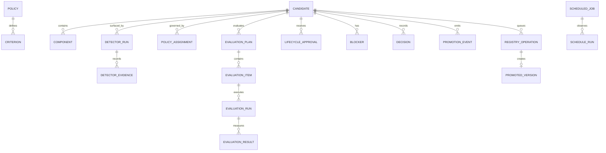

# Domain Model

## Candidate aggregate

A candidate identifies a proposed agent version and owns its lifecycle stage, orthogonal operational status, optimistic revision, active policy assignment, and component references. Lifecycle stages are policy-configured strings; the default path is:

```text
DISCOVERED -> CANDIDATE -> EVALUATING -> ELIGIBLE -> SHADOW -> PROMOTED -> MONITORED
```

Operational status is one of `ACTIVE`, `BLOCKED`, `PROMOTION_PENDING`, `REJECTED`, `SUSPENDED`, or `RETIRED`. A pending or failed registry operation does not erase completed evaluation evidence.

## Normalized records

| Record | Purpose | Important invariants |
|---|---|---|
| Candidate / component | Version under review and its composed assets | UUID identity; UTC timestamps; optimistic revision |
| Detector revision / run / evidence | How the candidate was surfaced | Immutable hashed revision; persisted source signal |
| Policy / criterion / assignment | Required evidence and thresholds | Immutable version; canonical SHA-256 hash |
| Evaluation plan / item / run / result | Planned work and typed measurements | Active-plan and staleness validation |
| Promotion lifecycle approval | Reviewer lifecycle decision | Exact candidate, target, policy, snapshot, decision, actor, rationale |
| Blocker / decision | Non-compensable stops and immutable decision snapshots | Clear/add lineage; canonical snapshot hash |
| Promotion event | Ordered audit fact | Append-only database trigger; transactionally emitted |
| Scheduled job / run | Externally triggered work definition and observations | Trigger owner; no resident scheduler claim |
| Evidence artifact | Sanitized variable output | Validated JSONB metadata; content hash |
| Registry operation | Leased publication request | Stable token; bounded retry; terminal typed failure |
| Promoted agent / version | Successfully published registry identity | Created only after registry success; immutable version |
| External event delivery | Optional sink attempt and acknowledgement | Unique event-and-sink identity; host-owned delivery policy |
| Idempotency receipt | Request fingerprint and stored response | Same key plus different body returns conflict |

Use JSONB only for validated evidence, signals, snapshots, and provider metadata whose structure varies by adapter. Query-critical states, ownership, scores, costs, hashes, revisions, and foreign keys are typed columns. Scores and costs use exact numeric columns rather than binary floating point.

## Canonical configuration identity

Policies, criteria, detectors, evaluators, plans, and decision snapshots are canonicalized before SHA-256 hashing. Canonicalization sorts object keys, uses stable scalar serialization, and excludes storage timestamps and database identities. Registering an existing logical ID and version with different content fails; it never mutates the prior revision.

## Relationships



## Event lineage

Correlation IDs group one user or external-trigger intent. Causation IDs link each resulting event to the preceding command or event. Event payloads carry a schema version and use explicit related-record columns so audit queries do not depend on parsing arbitrary JSON.

## Time and identity

All primary identities are UUIDs. Persist timestamps in UTC and render them in the viewer's timezone. Schedule calculations store the named timezone and record daylight-saving-time resolution; “Next expected trigger” is an observation, not a promise from this application.

## Demo reset boundary

The trusted demo reset rebuilds mutable fixture tables under an exclusive maintenance lock. It never updates, deletes, or truncates `promotion_events`; sequence numbers continue increasing. The reset appends `DEMO_RESET_COMPLETED`, and workers use the matching shared lock before claiming work. Production deployments disable this endpoint with `DEMO_MODE=false`.
