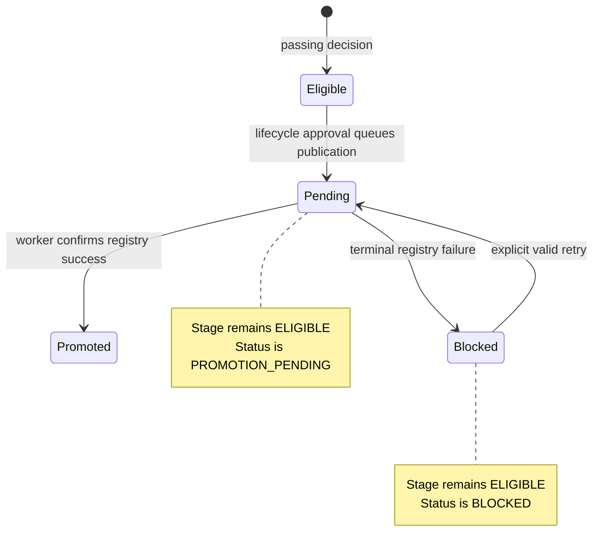

# Promotion Model

## Three separate answers

The product never collapses these questions into one status:

1. **Evaluation readiness:** Is the required evidence complete and passing?
2. **Promotion eligibility:** Are evidence, lifecycle stage, snapshot, and lifecycle approvals valid now?
3. **Registry activation:** Was publication not requested, queued, successful, or terminally failed?

A candidate can retain 100% evaluation readiness while registry activation is pending or failed.

## Asynchronous lifecycle

`POST /api/v1/candidates/{id}/promote` locks the candidate and validates the latest eligible decision, exact policy and evidence snapshot, required lifecycle approvals, and expected candidate revision. In one transaction it stores the immutable promotion decision, creates a queued registry operation with a stable publication token, keeps the stage `ELIGIBLE`, changes status to `PROMOTION_PENDING`, and emits `PROMOTION_APPROVED` and `PROMOTION_REGISTRY_QUEUED`. It returns `202 Accepted` with the operation ID, new candidate revision, correlation ID, and stream URL.

The worker claims the operation with a lease. On registry success, one transaction creates the immutable agent version, moves the stage to `PROMOTED`, sets status `ACTIVE`, and emits `PROMOTED`. No promoted state or event exists before that point.

On terminal failure, the worker leaves or returns the stage to `ELIGIBLE`, sets status `BLOCKED`, creates blocker `REGISTRY_OPERATION_FAILED`, and emits typed failure and blocker events. An explicit retry needs a new request idempotency key and revalidates the policy and evidence snapshot. It reuses the stable publication token so a crash after external success cannot create a duplicate version.

There is no bypass or force-promote route.

## Lifecycle approval

The domain term is `PromotionLifecycleApproval`. Each approval binds the exact candidate, target stage, policy hash, evaluation snapshot hash, decision, actor, and rationale. A reviewer may revoke it only before registry publication is queued. Queuing consumes and locks the approval snapshot.

No evaluation run needs an approval. Evaluation gathering is evidence production, not a production execution authorization.

> Promotion changes which tested version new production runs select. It does not authorize a run or grant tool access.

Paul OS bounded authority envelopes remain downstream controls for execution scope, tools, inputs, budgets, validity, and run counts. The first production run after promotion, any scope expansion, and any explicitly approval-required action still follow the envelope flow. Promotion lifecycle approval is therefore not a reintroduction of per-run approvals.

Standalone mode may open the governed lifecycle-decision dialog. An embedded host injects the decision callback; Paul OS routes that callback through Attention, its sole mutation surface.

## Conflicts and idempotency

- Every mutation requires `Idempotency-Key`.
- Reusing a key with a different canonical body returns RFC 7807 `409` with a stable problem code.
- Candidate mutations require `expected_candidate_revision`; a stale revision returns `409` and the current revision.
- A stale decision, policy hash, evidence snapshot, consumed or revoked approval, or invalid target blocks publication.
- Publication retries reuse the registry operation's stable token even though the HTTP retry has a new request key.
